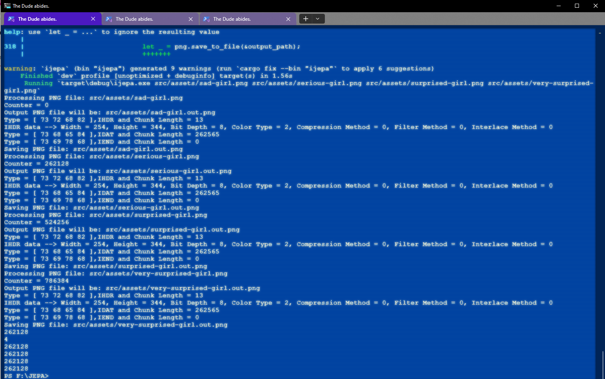

## JEPA (Joint Embedding Predictive Architecture) for Images

### Project Overview
Implementation of Image-based Joint Embedding Predictive Architecture (I-JEPA) - a self-supervised learning framework for visual representation learning. This project integrates custom-built components across multiple languages (Rust, C, C++) to create a complete training pipeline from image processing to model training.

**JEPA** is a self-supervised learning framework proposed by ``Yann LeCun`` and his team at ``Meta AI``. Its key characteristics include:
- **Purpose**: Learning representations from unlabeled data by predicting one part of the data from another part.
- **Mechanism**: Uses two encoders (context and target) and a predictor network.
- **Training**: Learns by predicting the embeddings of masked/future parts of inputs from visible parts.
- **Focus**: Primarily focused on representation learning rather than complete world modeling.
- **Applications**: Computer vision, speech recognition, and other perceptual tasks.

### Dependencies and easy dependency installation

The project includes a convenient script for fetching all dependencies in one go:

**Navigate to the** `./lib` **directory:**
   ```bash
   cd ./lib
   ./PULL.cmd
   ```

After executing the PULL.cmd script, the following dependencies will be cloned from GitHub for the JEPA image model implementation:

1. **numrs** - Numerical operations library in `Rust`
   - Repository: `https://github.com/KHAAdotPK/numrs.git`
   - Purpose: Matrix operations and tensor manipulations

2. **argsv-rust** - Command-line argument parsing
   - Repository: `https://github.com/KHAAdotPK/argsv-rust.git`
   - Purpose: Processing command-line options and arguments

3. **PNG-rust** - PNG image processing
   - Repository: `https://github.com/KHAAdotPK/PNG-rust.git`
   - Purpose: Reading and processing PNG image files

4. **allocator** - Memory allocation utilities in C++
   - Repository: `https://github.com/KHAAdotPK/allocator.git`
   - Purpose: Custom memory management

5. **parser** - Parser utilities in C++
   - Repository: `https://github.com/KHAAdotPK/parser.git`
   - Purpose: Parsing various data formats

6. **String** - String utilities in C++
   - Repository: `https://github.com/KHAAdotPK/String.git`
   - Purpose: Extended string handling capabilities

7. **csv** - CSV file processing in C++
   - Repository: `https://github.com/KHAAdotPK/csv.git`
   - Purpose: Reading and writing CSV data

8. **ala_exception** - Exception handling in C++
   - Repository: `https://github.com/KHAAdotPK/ala_exception.git`
   - Purpose: Custom exception management


#### Input pipeline is working


